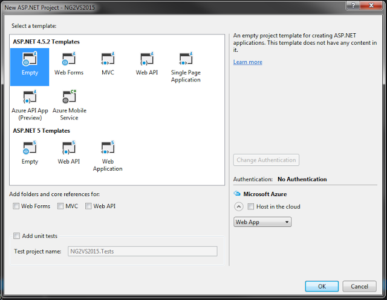

On the 15th of December, Angular 2 finally hit beta status. I immediately wanted to run through the QuickStart tutorial and take it for a spin. On my Macbook at home, this went swimmingly. Following the directions worked exactly as it should.

The next day, I thought I'd take a crack at using it in my work environment. We're a Microsoft shop, so that means Visual Studio, ASP.NET, etc. I thought I'd try a simple WebAPI 2 project with an Angular2 front end. I dummied up a simple WebAPI controller, added my package.json and tsconfig.json, and installed all the npm packages I needed. Once I added the TypeScript files, I noticed some issues.

First, the editor was flagging my import statement from angular2/core as not found.


Second, even though I had a tsconfig.json and Visual Studio 2015 seemed to recognize and even provide intellisense for it, the editor was not recognizing the @Component decorator.


The biggest issue was that now I couldn't even build the project. Visual Studio by default was trying to compile the TypeScript files as part of the whole project build. It wasn't just syntax highlighting issues, the Typescript compiler was throwing an error and causing the whole project to bail. I don't plan on using VS to build my front-end code anyway, so this was really irksome.

### A Sample Project

---

Let's create a project so we can see the issues, and then fix them. We'll start with an empty ASP.NET Web Project.




Now let's init npm and install the packages we need.

```
$> npm init -y
$> npm install -S angular2 systemjs es6-promise es6-shim reflect-metadata rxjs zone.js
```

Then we add our tsconfig.json file.

```json
{
  "compilerOptions": {
    "target": "es5",
    "module": "system",
    "sourceMap": true,
    "emitDecoratorMetadata": true,
    "experimentalDecorators": true,
    "removeComments": false,
    "noImplicitAny": false,
    "moduleResolution": "node"
  },
  "exclude": ["node_modules"]
}
```

Add an app folder with the below TypeScript files.

```
//app.component.ts

import {Component} from 'angular2/core';

@Component({
    selector: 'my-app',
    template: '<h1>My First Angular 2 App</h1>'
})
export class AppComponent { }
```

```
//boot.ts

import {bootstrap} from 'angular2/platform/browser';
import {AppComponent} from './app.component';

bootstrap(AppComponent);
```

We need an index.html file.

```html
<html>
    <head>
        <title>Angular 2 QuickStart</title>

        <script src="node_modules/angular2/bundles/angular2-polyfills.js"></script>
        <script src="node_modules/systemjs/dist/system.src.js"></script>
        <script src="node_modules/rxjs/bundles/Rx.js"></script>
        <script src="node_modules/angular2/bundles/angular2.dev.js"></script>

        <script>
            System.config({
                packages: {
                    app: {
                        format: 'register',
                        defaultExtension: 'js'
                    }
                }
            });
            System.import('app/boot')
            .then(null, console.error.bind(console));
        </script>
    </head>

    <body>
        <my-app>Loading...</my-app>
    </body>
</html>
```

Finally, let's add a dummy C# file so VS has something to try to build. Otherwise, the build issue won't trigger.

```csharp
using System;
using System.Collections.Generic;
using System.Linq;
using System.Web;

namespace NG2QuickStartVS
{
    public class DumbModel
    {
        public int ID { get; set; }
    }
}
```

Now we've got a project that looks right, but won't build.

### Getting it to work

---

After a few hours of Googling, I was able to piece together some of the issues:

1.  Angular 2 isn't using a .d.ts file for typings and has instead elected to use the node form of module resolution. The tsconfig.json laid out in the tutorial specifies this, but VS isn't respecting it.
2.  VS2015 has support for tsconfig.json files, but only in ASP.NET vNext projects. In 4.x projects, the .csproj file takes precedence. This is why the module resolution and and experimental decorator features aren't working.

So how do we get this working? The Typescript Build page in the project properties doesn't have any options for these two settings. The trick lies in the black arts of MSBuild. Here's what you need to do:

1.  Right click your project in the solution explorer and select Unload Project.
2.  Edit the .csproj file.
3.  Add the following lines towards the bottom of the file in the with all the TypeScript tags (you may need to make a change to the TypeScript settings in the Project Properties and then save to get these to show):

    ```xml
    <TypeScriptExperimentalDecorators>true</TypeScriptExperimentalDecorators>
    <TypeScriptModuleResolution>NodeJs</TypeScriptModuleResolution>
    ```

4.  Save and reload the project.

Hooray the red squigglies are gone! All is well! Let's build the project and see the fruits of our labor.


WTF?!?! We specified that we wanted node format module resolution. Why isn't this working? Well, it appears that VS is trying to pass the compiler the literal value we put in the .csproj file of NodeJs and not the node that it should be. Thus the compiler error. The only way I've seen to get around this is to put the following line in the first of the .csproj file, thereby turning off TypeScript compilation within the IDE:

```xml
<TypeScriptCompileBlocked>true</TypeScriptCompileBlocked>
```

This means you'll need to have some sort of external build process for your front-end code, but why wouldn't you? With tools like Gulp, Grunt, Webpack, etc., you should be using an external build tool.

Go ahead and build now and all should be well.

### Wrap Up

---

Hopefully this should help you get started working with Angular 2 in Visual Studio 2015. The changes that have been made to the framework are exciting, and I can't wait to put it to use at work. If you have any better solutions than what I have outlined in this post, please let me know in the comments. This all came about through my own trial and error, so I could very well be missing out on a much better way to do this.

I hope to do another post soon showing using Angular 2 with a simple WebAPI backend, and using Webpack as a build tool. Until then, happy coding!
